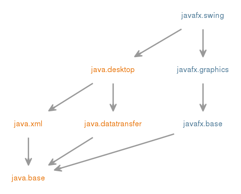

## Java 9 and Interface overused
---
## Agenda
1.  Java 9
2.  Interface Usage

---
## Java 9

1.  Jshell
2.  Jlink
3.  Modules
---

## Jshell Demo
Project Kulla (REPL) Read-eval-Print Loop

---

## Jlink Demo

Create Runtime Image
---

## Modules

Example For Swing: 

---
## Modules
Declaration:

module-info.java

<code>
module packA.module {

}
</code>

Demo
---

## Interfaces
---

## Interface Use Case
1.  More than one implementation of a common interface
2.  Public library such as Nuget Package (you don't have control over it)
3.  When a single class is playing multiple roles. Implement many interfaces

---
##Interfaces Demo
---

