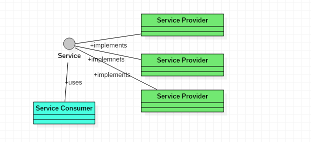

---
output:
  revealjs::revealjs_presentation:
    incremental: true
---

## Java 9 
## Interface overusing
---
## Agenda
1.  Java 9
2.  Interface Overusing

---
## Java 9

1.  Jshell  <!-- .element: class="fragment" -->
1.  Modules (Jigsaw) <!-- .element: class="fragment" -->
1.  Jlink  <!-- .element: class="fragment" -->
---

## Jshell Demo
Project Kulla (REPL) Read-eval-Print Loop

---
## Modules
 Before go into details let's remind few things
 * Package  <!-- .element: class="fragment" -->
 * Classpath   <!-- .element: class="fragment" -->
 * Jar  <!-- .element: class="fragment" -->
---

## Package definition
* Package is a namespace that organizes a set of related classes and interfaces.
    
    Conceptually you can think of packages as being similar to different folders on your computer

---

## What is classpath
Classpath is a parameter in the Java Virtual Machine or the Java compiler that specifies the location of user-defined classes and packages.

---
## Jar

JAR stands for Java ARchive. It's a file format based on the popular ZIP file format and is used for aggregating many files into one.

---

## Sample old app

<table class="wikitable" style="font-size:90%">
<tbody><tr>
<th><a href="/wiki/Microsoft_Windows" title="Microsoft Windows">Microsoft Windows</a></th>
</tr>
<tr>
<td>
<pre>D:\myprogram\
      |
      ---&gt; org\  
            |
            ---&gt; mypackage\
                     |
                     ---&gt; HelloWorld.class       
                     ---&gt; SupportClass.class   
                     ---&gt; UtilClass.class     
</pre></td>
</tr>
</tbody></table>

---

## Running Application 
java -classpath D:\myprogram org.mypackage.HelloWorld

---

## Modules

Before  Jigsaw
*  Classpath Hell <!-- .element: class="fragment" -->
*  NoClassDefFoundError at runtime (example: 2 version of 3rd pary jar in classpath ) <!-- .element: class="fragment" -->
*  Java 8 and below not know about their own dependencies <!-- .element: class="fragment" -->

---

## What is Jigsaw
Project Jigsaw

Work on Project Jigsaw began in August 2008 with an initial exploratory phase. Work on the design and implementation for Java 9 began in 2014.

---

## Module definition
Basically, a module is nothing more than a good old JAR file, compiled from good old Java files. But there is one crucial difference: one of the files is called module-info.java. As the name suggests, it declares our module.

---
## Jigsaw

1.  the unique name of our module <!-- .element: class="fragment" -->
2.  which other modules our module depends on <!-- .element: class="fragment" -->
3.  which packages are to be exported to be used by other modules <!-- .element: class="fragment" -->

---

## Modules

Example For Swing: 


---
## Modules
Declaration:
module-info.java <!-- .element: class="fragment" -->

module moduleA { <!-- .element: class="fragment" -->

}<!-- .element: class="fragment" -->


---
## Demo

---

## What if we want to add modules dynamically ?

Services <!-- .element: class="fragment" -->
---

## Services



---
## Services
What give us ?

* Plugin architecture

* Adding modules without recompilation

---
## Service
```
module commonApi{

    exports com.api;
}

```
---

## Services Privders
```
module com.api.providerimplone {

    requires commonApi;
    provides com.api.MyService with com.api.providerimplone.ProviderImplOne;
}
```
---

## Services Consumer
``` java
module com.api.client{

    requires commonApi;
    uses com.api.MyService;
}
```
---

## Jlink

Create Runtime Image
---

## Interfaces

### Definition
---

## Interface

In Object Oriented Programming an Interface is a description of all functions that object must have in order to be an "X". The purpose of interfaces is to allow the computer to enforce these properties and to know that an object of TYPE T (whatever the interface is ) must have functions called X,Y,Z, etc.

---

## Interface
Why we are using interface?

* create loosely coupled software <!-- .element: class="fragment" -->
* support design by contract (an implementor must provide the entire interface) <!-- .element: class="fragment" -->
* allow for pluggable software <!-- .element: class="fragment" -->
* allow different objects to interact easily <!-- .element: class="fragment" -->
* hide implementation details of classes from each other <!-- .element: class="fragment" -->
---


## Problem 

Developers start using interface for almost every class.

---
## Interfaces

*  Without interface you cannot do  Dependency Injection  <!-- .element: class="fragment" -->
*  What about testing in isolation  <!-- .element: class="fragment" -->

---


